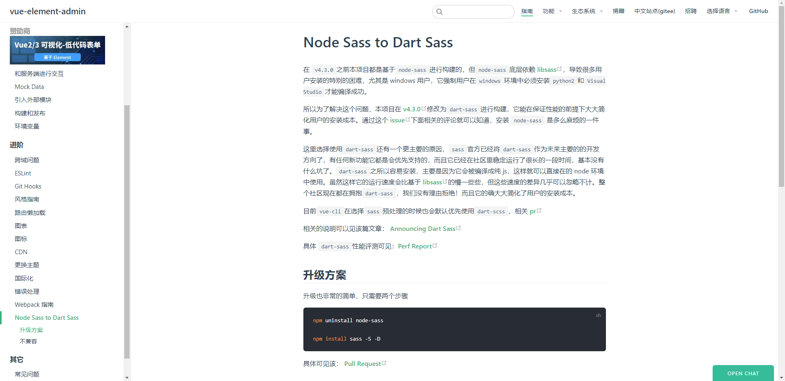

如果让我们手工的来编辑这些字符画，显然是一件非常困难的差事。所以，我们可以借助下面这些工具，轻松地根据文字或图片来生成用于Banner输出的字符画。

https://www.bootschool.net/ascii

https://www.degraeve.com/img2txt.php

https://patorjk.com/software/taag

http://www.network-science.de/ascii/

使用 新技术 Dart Sass 替代 Node Sass 大大提速

https://panjiachen.github.io/vue-element-admin-site/zh/guide/advanced/sass.html#%E4%B8%8D%E5%85%BC%E5%AE%B9

